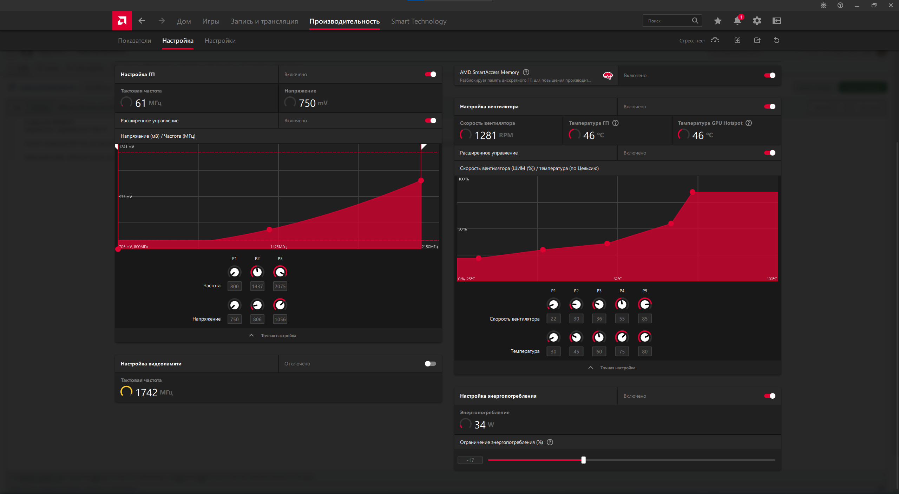

# Undervolt-RX5700-XT  
Андервольтинг видеокарты RX 5700 XT  

Частота ограничена 2075 МГц при максимальном напряжении 1056 мВ.  
Температура и характеристики радиатора вентиляторного типа регулируются, что обеспечивает более объективную и стабильную работу, а также снижает температуру и шум вентилятора графического процессора.  

## Импорт пресета  
1. Импортируйте файл `undervolt-preset.xml` на панели AMD Radeon Software.  
2. Перейдите во вкладку **"Производительность"** -> **"Настройка"**.  
3. Включите **ручной режим** и загрузите файл.  
4. Перезапустите систему для применения изменений.  

## Характеристики ПК  
- **Процессор:** AMD Ryzen 5 8400F 
- **Видеокарта:** AMD Radeon RX 5700 XT 8GB
- **Оперативная память:** 16 ГБ DDR5
- **Материнская плата:** Colorful BATTLE-AX B650M-WHITE WIFI V14
- **Монитор:** TianSu 2560x1440p

  
